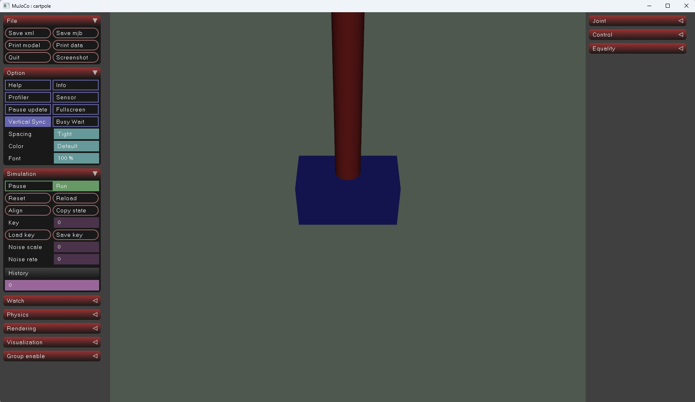

# Create New Task

This guide walks you step by step through creating a new task, training it, and performing inference.

> **🚧 Work in Progress**  
> Some parameters still need to be tuned to ensure training convergence.

## 1. Prepare Your Robot 
For a minimal demonstration, we’ll create a simple CartPole environment without requiring any .stl files.

First, navigate to the directory `mjlab\src\mjlab\asset_zoo\robots`, and create the following structure:

```
cartpole
 │ cartpole_constants.py  # Defines the CartPole robot configuration and loads the MuJoCo model.
 │ __init__.py            # Marks the folder as a Python package.
 │
 └─xmls
      cartpole.xml        # Describes the CartPole's physical structure and actuator setup.
```

### 1) cartpole.xml

```xml
<mujoco model="cartpole">
  <compiler angle="degree" coordinate="local" inertiafromgeom="true"/>
  <option timestep="0.02" gravity="0 0 -9.81"/>

  <worldbody>
    <geom name="ground" type="plane" pos="0 0 0" size="5 5 0.1" rgba="0.8 0.9 0.8 1"/>

    <body name="cart" pos="0 0 0.1">
      <geom type="box" size="0.2 0.1 0.1" rgba="0.2 0.2 0.8 1"/>
      <joint name="slide" type="slide" axis="1 0 0" limited="true" range="-2 2"/>

      <body name="pole" pos="0 0 0.1">
        <geom type="capsule" size="0.05 0.5" fromto="0 0 0 0 0 1" rgba="0.8 0.2 0.2 1"/>
        <joint name="hinge" type="hinge" axis="0 1 0" range="-90 90"/>
      </body>
    </body>
  </worldbody>

  <actuator>
    <velocity name="slide_velocity" joint="slide" ctrlrange="-20 20" kv="40"/>
  </actuator>

  <keyframe>
    <key name="cartpole_init" qpos="0 0" qvel="0 0" ctrl="0 0"/>
  </keyframe>
</mujoco>

```

### 2) cartpole_constants.py

```python
from pathlib import Path
import mujoco

from mjlab import MJLAB_SRC_PATH
from mjlab.entity import Entity, EntityCfg, EntityArticulationInfoCfg
from mjlab.utils.spec_config import ActuatorCfg

# Path to the MuJoCo XML file
CARTPOLE_XML: Path = (
    MJLAB_SRC_PATH / "asset_zoo" / "robots" / "cartpole" / "xmls" / "cartpole.xml"
)
assert CARTPOLE_XML.exists(), f"XML not found: {CARTPOLE_XML}"


def get_spec() -> mujoco.MjSpec:
    """Load the MuJoCo model specification."""
    return mujoco.MjSpec.from_file(str(CARTPOLE_XML))


# Actuator configuration: controls the slide joint (the cart)
CARTPOLE_ACTUATOR = ActuatorCfg(
    joint_names_expr=["slide"],   # Joint to control
    effort_limit=5.0,             # Maximum force/effort
    stiffness=0.0,                # No position stiffness (velocity control)
    damping=0.1,                  # Damping factor
)

# Articulation configuration
CARTPOLE_ARTICULATION = EntityArticulationInfoCfg(
    actuators=(CARTPOLE_ACTUATOR,),
)

# Entity configuration
CARTPOLE_ROBOT_CFG = EntityCfg(
    spec_fn=get_spec,
    articulation=CARTPOLE_ARTICULATION,
)

if __name__ == "__main__":
    import mujoco.viewer as viewer

    # Initialize the entity and launch the MuJoCo viewer
    robot = Entity(CARTPOLE_ROBOT_CFG)
    viewer.launch(robot.spec.compile())
```
You can test whether the environment has been successfully set up by running `uv run cartpole.py`. If the setup is successful, you should see an interface similar to the one below:



### 3) \_\_init\_\_.py
It’s just an empty file used to mark the folder as a Python package.

## 2. Register Robot

Open file `mjlab\src\mjlab\asset_zoo\robots\__init__.py`, add cartpole robot item.

```python
from mjlab.asset_zoo.robots.unitree_g1.g1_constants import G1_ROBOT_CFG
from mjlab.asset_zoo.robots.unitree_go1.go1_constants import GO1_ROBOT_CFG
from mjlab.asset_zoo.robots.cartpole.cartpole_constants import CARTPOLE_ROBOT_CFG # New robot item

__all__ = (
  "G1_ROBOT_CFG",
  "GO1_ROBOT_CFG",
  "CARTPOLE_ROBOT_CFG", # New robot item
)
```

## 3. Create Task

### 1) Create file structure

Navigate to the directory `mjlab\src\mjlab\tasks`, and create the following structure:

```
cartpole
 │ cartpole_env_cfg.py  # Defines the task settings.
 └─__init__.py            # Marks the folder as a Python package.
```

### 2) cartpole_env_cfg.py

```python
"""CartPole task environment configuration. """

import math
from dataclasses import dataclass, field
import torch
from mjlab.envs import ManagerBasedRlEnvCfg
from mjlab.managers.manager_term_config import (
    ObservationGroupCfg as ObsGroup,
    ObservationTermCfg as ObsTerm,
    RewardTermCfg as RewardTerm,
    TerminationTermCfg as DoneTerm,
    EventTermCfg as EventTerm,
    term,
)
from mjlab.managers.scene_entity_config import SceneEntityCfg
from mjlab.scene import SceneCfg
from mjlab.sim import MujocoCfg, SimulationCfg
from mjlab.viewer import ViewerConfig
from mjlab.asset_zoo.robots import CARTPOLE_ROBOT_CFG
from mjlab.rl import RslRlOnPolicyRunnerCfg
from mjlab.envs import mdp


# ==========================================================
# Scene configuration
# ==========================================================

SCENE_CFG = SceneCfg(
    num_envs=64,               # Number of parallel simulated environments
    extent=1.0,                # Spacing between environments in visualization
    entities={"robot": CARTPOLE_ROBOT_CFG},  # Use CartPole robot configuration
)

# Viewer visualization setup
VIEWER_CONFIG = ViewerConfig(
    origin_type=ViewerConfig.OriginType.ASSET_BODY,  # Camera follows the robot body
    asset_name="robot",
    body_name="pole",
    distance=3.0,    # Camera distance
    elevation=10.0,  # Camera tilt angle
    azimuth=90.0,    # Camera rotation angle
)


# ==========================================================
# Action configuration
# ==========================================================

@dataclass
class ActionCfg:
    # Define action as direct control over the slide joint (cart position)
    joint_pos: mdp.JointPositionActionCfg = term(
        mdp.JointPositionActionCfg,
        asset_name="robot",
        actuator_names=[".*"],    # Match all actuators
        scale=20.0,               # Scale of control signal
        use_default_offset=False, # No offset in joint control
    )


# ==========================================================
# Observation configuration
# ==========================================================

@dataclass
class ObservationCfg:

    # Policy network observation terms
    @dataclass
    class PolicyCfg(ObsGroup):
        angle: ObsTerm = term(
            ObsTerm,
            func=lambda env: env.sim.data.qpos[:, 1:2] / math.pi,  # Normalize angle to [-1, 1]
        )
        ang_vel: ObsTerm = term(
            ObsTerm,
            func=lambda env: env.sim.data.qvel[:, 1:2] / 10.0,     # Normalize angular velocity
        )
        cart_pos: ObsTerm = term(
            ObsTerm,
            func=lambda env: env.sim.data.qpos[:, 0:1] / 2.0,      # Normalize cart position
        )
        cart_vel: ObsTerm = term(
            ObsTerm,
            func=lambda env: env.sim.data.qvel[:, 0:1] / 5.0,      # Normalize cart velocity
        )

    # Critic network (value function) observation terms
    @dataclass
    class CriticCfg(PolicyCfg):
        """
        The critic uses the same observation inputs as the policy.
        """
        pass

    policy: PolicyCfg = field(default_factory=PolicyCfg)
    critic: CriticCfg = field(default_factory=CriticCfg)


# ==========================================================
# Reward configuration
# ==========================================================

@dataclass
class RewardCfg:
    # Reward for keeping the pole upright
    upright: RewardTerm = term(
        RewardTerm,
        func=lambda env: (env.sim.data.qpos[:, 1].cos()),  # Max reward when pole is vertical
        weight=3.0,
    )

    # Penalty for using too much control effort
    effort: RewardTerm = term(
        RewardTerm,
        func=lambda env: -0.01 * (env.sim.data.ctrl[:, 0] ** 2),
        weight=1.0,
    )


# ==========================================================
# Event configuration (random resets or disturbances)
# ==========================================================

def random_push_cart(env, env_ids, force_range=(-5.0, 5.0)):
    """
    Apply a random external force to the cart (slide joint).

    Args:
        env: The environment object.
        env_ids: IDs of environments to apply the force to.
        force_range: Tuple of (min_force, max_force) range.
    """
    n = len(env_ids)
    random_forces = (
        torch.rand(n, device=env.device) * (force_range[1] - force_range[0]) + force_range[0]
    )
    # Apply to the 0th DOF (the sliding joint)
    env.sim.data.qfrc_applied[env_ids, 0] = random_forces


@dataclass
class EventCfg:
    """Defines events such as resets or periodic disturbances."""

    # Reset robot joints within a small random range
    reset_robot_joints: EventTerm = term(
        EventTerm,
        func=mdp.reset_joints_by_scale,
        mode="reset",
        params={
            "asset_cfg": SceneEntityCfg("robot"),
            "position_range": (-0.1, 0.1),
            "velocity_range": (-0.1, 0.1),
        },
    )

    # Randomly push the cart at intervals to increase robustness
    random_push: EventTerm = term(
        EventTerm,
        func=random_push_cart,                # Use the helper function defined above
        mode="interval",
        interval_range_s=(1.0, 2.0),          # Apply every 1–2 seconds
        params={"force_range": (-100.0, 100.0)},
    )


# ==========================================================
# Termination (episode end) conditions
# ==========================================================

@dataclass
class TerminationCfg:
    # End the episode after the max time limit
    timeout: DoneTerm = term(
        DoneTerm,
        func=lambda env: False,
        time_out=True,
    )

    # End the episode if the pole falls beyond ±45 degrees
    tipped: DoneTerm = term(
        DoneTerm,
        func=lambda env: (env.sim.data.qpos[:, 1].abs() > math.radians(45)).any(dim=-1),
        time_out=False,
    )


# ==========================================================
# Simulation configuration
# ==========================================================

SIM_CFG = SimulationCfg(
    mujoco=MujocoCfg(
        timestep=0.02,   # 50 Hz simulation
        iterations=1,    # Physics solver iterations
    ),
)


# ==========================================================
# Full environment configuration
# ==========================================================

@dataclass
class CartPoleEnvCfg(ManagerBasedRlEnvCfg):
    """Main configuration class for the CartPole (Inverted Pendulum) environment."""

    scene: SceneCfg = field(default_factory=lambda: SCENE_CFG)
    observations: ObservationCfg = field(default_factory=ObservationCfg)
    actions: ActionCfg = field(default_factory=ActionCfg)
    rewards: RewardCfg = field(default_factory=RewardCfg)
    events: EventCfg = field(default_factory=EventCfg)
    terminations: TerminationCfg = field(default_factory=TerminationCfg)
    sim: SimulationCfg = field(default_factory=lambda: SIM_CFG)
    viewer: ViewerConfig = field(default_factory=lambda: VIEWER_CONFIG)

    decimation: int = 1              # Control frequency multiplier
    episode_length_s: float = 10.0   # Maximum episode duration (in seconds)


# ==========================================================
# Entry points for training and inference
# ==========================================================

env_cfg_entry_point = CartPoleEnvCfg
rl_cfg_entry_point = RslRlOnPolicyRunnerCfg

```

### 3) \_\_init\_\_.py
It’s just an empty file used to mark the folder as a Python package.

## 4. Train

run `uv run play --task Mjlab-cartpole --env.scene.num-envs 64`

## 5. Inference

run `uv run play --task Mjlab-cartpole-Play --checkpoint_file Your File Name`
