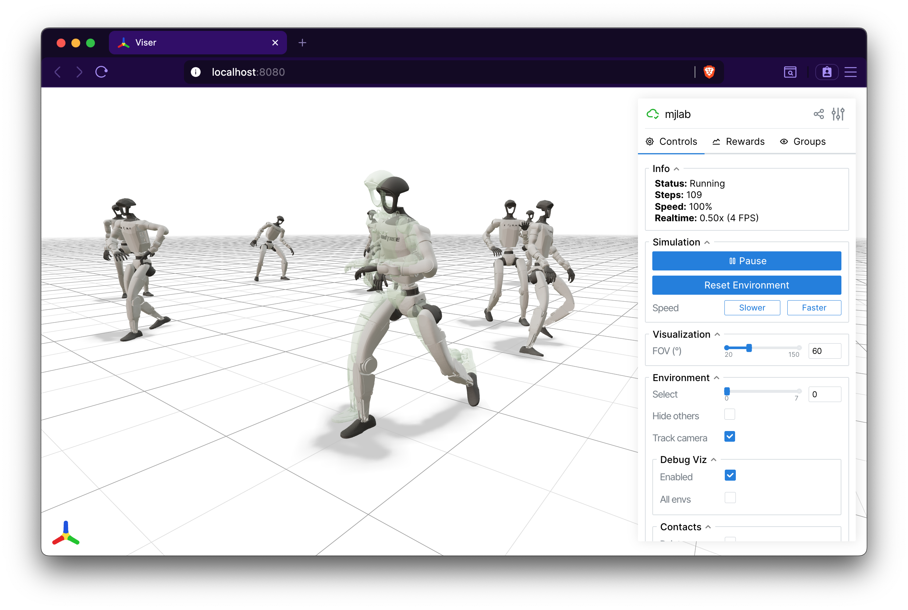

.. _commands:

Commands
========

Commands specify what the policy should achieve at each moment: a target
velocity, a reference trajectory, a goal position. The command manager
generates these signals, resamples them at configurable intervals, and
passes them to the policy through the observation system.

Registration
------------

Commands are registered in ``ManagerBasedRlEnvCfg`` as a dictionary
mapping string names to ``CommandTermCfg`` instances. Unlike the
function-based terms used by other managers, every command term is a
class that inherits from ``CommandTerm``.

The ``resampling_time_range`` field controls how often the command
changes. After each resample the term draws a new timer value uniformly
from the given ``(min, max)`` range in seconds. Commands are also
resampled unconditionally on every episode reset.

.. code-block:: python

    commands = {
        "twist": UniformVelocityCommandCfg(
            entity_name="robot",
            resampling_time_range=(3.0, 8.0),
            ranges=UniformVelocityCommandCfg.Ranges(
                lin_vel_x=(-1.0, 1.0),
                lin_vel_y=(-1.0, 1.0),
                ang_vel_z=(-0.5, 0.5),
            ),
        ),
    }

The ``generated_commands`` observation function reads the current
command tensor by name and passes it to the policy:

.. code-block:: python

    ObservationTermCfg(
        func=mdp.generated_commands,
        params={"command_name": "twist"},
    )

If the environment has no commands, the manager no-ops all operations
and returns empty tensors. There is no special handling required.

Command history
---------------

A command term only exposes the value it holds *right now*. Because
commands are resampled mid-episode, that value says little about what
the episode as a whole asked for: an environment commanded 0.1 m/s for
three seconds and 1.0 m/s for the next seventeen ends the episode
looking identical to one commanded 1.0 m/s throughout.

Setting ``track_command_history=True`` on any ``CommandTermCfg`` makes
the term record the whole episode:

.. code-block:: python

    commands = {
        "twist": UniformVelocityCommandCfg(
            resampling_time_range=(3.0, 8.0),
            track_command_history=True,
            ...
        ),
    }

The record is a sequence of *segments* -- the command drawn on reset,
then one per resample -- reachable through ``term.command_history``:

.. code-block:: python

    term = env.command_manager.get_term("twist")
    history = term.command_history
    assert history is not None  # None unless tracking is enabled.

    # history.commands     (num_envs, capacity, command_dim)
    # history.start_times  (num_envs, capacity), seconds into the episode
    # history.lengths      (num_envs,), how many slots are valid

A segment ends when the next one starts; the last one is still open, so
``durations`` asks the caller when it ends. Pass the current episode
time to measure the episode as it happened, or the full episode length
to hold the last command to the end:

.. code-block:: python

    weights = history.durations(env.max_episode_length_s)
    speeds = torch.norm(history.commands[:, :, :2], dim=-1)
    mean_speed = (speeds * weights).sum(-1) / weights.sum(-1).clamp(min=1e-6)

Two things to keep in mind. Each entry is a *snapshot* taken when the
segment began, not an average over it, so a term whose command keeps
changing within a segment -- ``UniformVelocityCommand`` in heading or
world-frame mode, where the yaw rate tracks a heading error and the
planar command rotates with the robot -- is only faithfully described
by the components it leaves alone. And the record is cleared per
episode, in ``reset()``; curriculum terms still see the episode that
just ended, because the curriculum manager resets before the command
manager does.

Custom terms that sample a new command outside the resampling timer
must say so, or the history will not see it. ``MotionCommand`` does
this when a clip wraps around:

.. code-block:: python

    def _update_command(self, env_ids=None):
        ...
        if wrap_ids.numel() > 0:
            self._resample_command(wrap_ids)
            self._record_command_resample(wrap_ids)

Such a term should also override ``_history_capacity`` to budget for
that extra cadence, using ``_segments_per_episode`` for the arithmetic.

Included command terms
----------------------

Each task ships with its own command terms tailored to its objective.

.. list-table::
   :header-rows: 1
   :widths: 28 72

   * - Term
     - Description
   * - ``UniformVelocityCommand``
     - Generates planar velocity commands ``[v_x, v_y, omega_z]``
       sampled uniformly from configurable ranges. Supports a standing
       mode (fraction of environments receive zero velocity) and a
       heading mode (yaw rate replaced by a proportional controller
       tracking a sampled heading angle). Used by the velocity task.
   * - ``LiftingCommand``
     - Generates a 3D target position for a manipulated object.
       Supports fixed and dynamic difficulty modes. Tracks metrics
       including position error and episode success rate. Used by the
       manipulation task.
   * - ``MotionCommand``
     - Streams reference joint positions, velocities, and body poses
       from a pre-recorded ``.npz`` motion clip. Supports three
       start-frame sampling modes: ``"start"`` (always frame 0),
       ``"uniform"`` (random), and ``"adaptive"`` (biased toward
       difficult regions). At reset the robot is initialized from the
       sampled frame with optional perturbations. Used by the tracking
       task.

Each term can render debug visualizations in the interactive viewer
when ``debug_vis=True`` is set in the configuration. The image below
shows the ghost visualization from ``MotionCommand``, which renders a
translucent copy of the robot at the reference pose alongside the
actual robot.

   Viser visualization of the commanded reference motion for the G1 tracking task.

Writing custom command terms
-----------------------------

A custom command term is a class inheriting from ``CommandTerm`` paired
with a configuration dataclass inheriting from ``CommandTermCfg``. The
term must implement four methods: ``_resample_command(env_ids)`` to
sample new goals, ``_update_command(env_ids)`` for per-step updates,
``_update_metrics()`` for logging, and a ``command`` property returning
the current goal tensor. The base class manages the resampling timer
and reset logic automatically.

``_update_command`` is called in two situations. On every environment
step it receives ``env_ids=None``, meaning update all environments.
After a reset it is called again with the ids of the environments that
were just reset, so their command state is brought up to date before
observations are computed.

The distinction matters when your update advances state, such as
incrementing a frame index into a reference motion. Apply such advances
only to ``env_ids`` (all environments when ``None``); otherwise
resetting a few environments would also advance every other one. Updates
that simply recompute values from the current simulation state, like a
heading error, give the same result no matter how often they run and can
safely ignore ``env_ids``.

The configuration must implement a ``build(env)`` method that
constructs the paired term instance.
