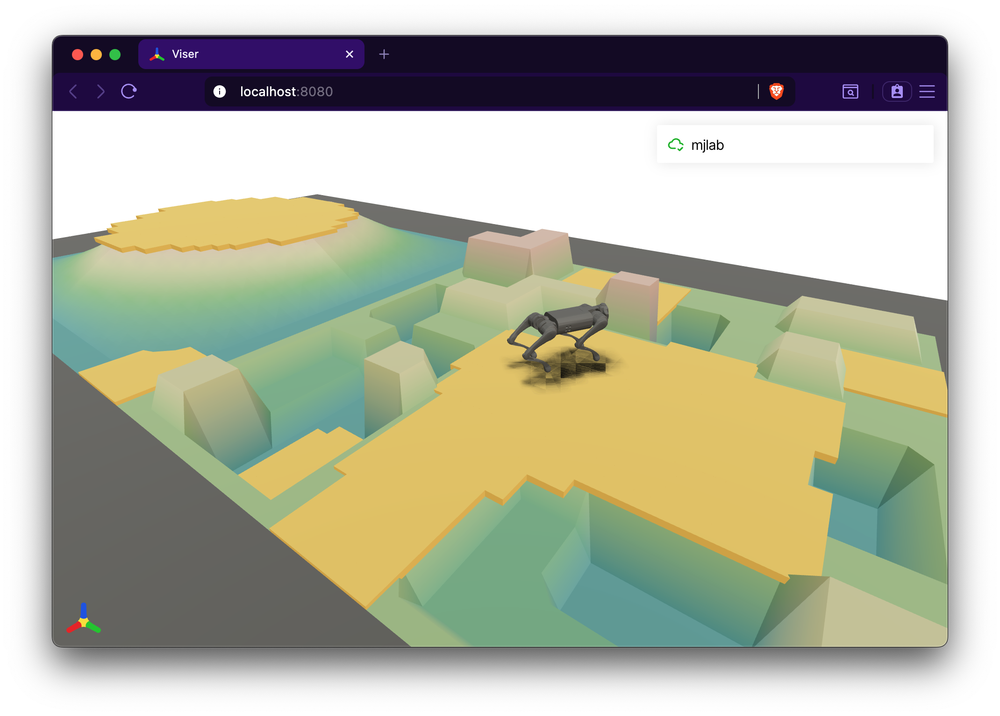

.. _terrain:

地形
====

地形是场景中所有环境共享的地面。mjlab 支持两种模式：适用于不需要变化
地形的任务的平地，以及把一组可配置难度的子地形块拼成网格的程序化地形
生成器。程序化地形对训练运动策略尤其有用——难度递增的地面课程能塑造
鲁棒的行走与攀爬行为。

地形通过 ``TerrainEntityCfg`` 配置，经 ``SceneCfg`` 的 ``terrain``
字段传入场景。地形如何与场景其余部分集成见 :ref:`scene`。

平地地形
--------

默认模式。单个地面，建模为 MuJoCo 平面 geom，没有程序化几何。环境按
规则网格排布，间距由 ``SceneCfg`` 的 ``env_spacing`` 控制。

.. code-block:: python

    from mjlab.terrains import TerrainEntityCfg

    terrain = TerrainEntityCfg(terrain_type="plane")

程序化地形
----------

对能从地形多样性中受益的任务（运动、导航），``TerrainGeneratorCfg``
组装一个矩形的子地形块网格。每块由一个 ``SubTerrainCfg`` 生成，后者
定义几何形状及其随难度的缩放方式。

.. code-block:: python

    from mjlab.terrains import TerrainEntityCfg
    from mjlab.terrains.terrain_generator import TerrainGeneratorCfg
    import mjlab.terrains as terrain_gen

    terrain = TerrainEntityCfg(
        terrain_type="generator",
        terrain_generator=TerrainGeneratorCfg(
            size=(8.0, 8.0),
            num_rows=10,
            border_width=20.0,
            curriculum=True,
            sub_terrains={
                "flat": terrain_gen.BoxFlatTerrainCfg(proportion=0.2),
                "stairs": terrain_gen.BoxPyramidStairsTerrainCfg(
                    proportion=0.4,
                    step_height_range=(0.0, 0.15),
                    step_width=0.3,
                    platform_width=2.0,
                ),
                "rough": terrain_gen.HfRandomUniformTerrainCfg(
                    proportion=0.4,
                    noise_range=(0.02, 0.10),
                    noise_step=0.02,
                ),
            },
        ),
        max_init_terrain_level=5,
    )

生成器创建 ``num_rows`` 乘以 ``num_cols``（随机模式）或
``len(sub_terrains)``（课程模式，忽略 ``num_cols``）的块网格。
``sub_terrains`` 字典把名称映射到 ``SubTerrainCfg`` 实例；课程模式下
每个子地形的 ``proportion`` 控制机器人在各列之间的出生分布，随机模式下
则控制每块的采样概率。

网格布局
^^^^^^^^

两种生成模式控制地形类型在网格上的分布：

**课程模式** （``curriculum=True`` ）。每种地形类型恰好占一列；无论
``num_cols`` 取值多少，生成器都使用 ``len(sub_terrains)`` 列。同一列的
所有块共享同一地形类型，难度从第 0 行（最简单）到第 ``num_rows - 1``
行（最难）递增。``proportion`` 字段控制出生时机器人在各列间的分布，
而不是列数。正是这种结构化布局让课程系统能随表现提升把环境推进到更难
的行。

**随机模式** （``curriculum=False`` ）。每块独立按 ``proportion`` 加权
采样一种地形类型，并从 ``difficulty_range`` 中采样难度。``num_cols``
被尊重。这种方式提供最大多样性，但没有结构化的难度递进。

难度参数
^^^^^^^^

每个子地形的生成函数都会收到一个 ``difficulty`` 值，线性插值该地形
可配置的范围。例如 ``step_height_range=(0.0, 0.2)`` 的
``BoxPyramidStairsTerrainCfg`` 在难度 0 时生成平地，在难度 1 时生成
20 cm 台阶。

课程模式下，难度由行决定：
``difficulty = lower + (upper - lower) * row / max(num_rows - 1, 1)``，
其中 ``(lower, upper) = difficulty_range``。第 0 行恰好是 ``lower``，
第 ``num_rows - 1`` 行恰好是 ``upper``，中间各行均匀分布。同一行的所有
列共享相同的难度标量；列间可见的差异来自各子地形类型在同一难度下生成
的几何形状不同。

.. note::

   ``num_rows=1`` 且 ``curriculum=True`` 时，每块都以
   ``difficulty = lower``（最简单的配置难度）生成。如果想要单层网格、
   随机采样难度，请改用 ``curriculum=False``。

随机模式下，难度对每块独立地从 ``difficulty_range`` 均匀采样。

子地形类型
----------

mjlab 提供两族子地形类型：由 box geom 构建的 **图元地形**，以及由连续
高程网格构建的 **高度场地形**。所有类型都继承 ``SubTerrainCfg``，
接受 ``proportion`` 权重和可选的 ``flat_patch_sampling`` 配置。

图元地形
^^^^^^^^

完全由 box geom 构建的程序化地形块。离散几何使它们特别适合楼梯、
踏脚石和其他结构化障碍。大多数图元类型共享几个常见参数：
``platform_width`` （中央平坦区）、``border_width`` （平坦边界），以及
一至多个随难度缩放的范围。

.. grid:: 3

   .. grid-item-card:: 平地（Flat）

      .. image:: ../../source/_static/terrains/box_flat.png

      平坦 box 地形块。适合作为课程网格中的简单基线。

   .. grid-item-card:: 金字塔楼梯（Pyramid Stairs）

      .. image:: ../../source/_static/terrains/box_pyramid_stairs.png

      金字塔楼梯，台阶向内下降至中央平台。

   .. grid-item-card:: 倒金字塔楼梯（Inverted Pyramid Stairs）

      .. image:: ../../source/_static/terrains/box_inverted_pyramid_stairs.png

      倒金字塔，台阶从外向内上升。

   .. grid-item-card:: 随机楼梯（Random Stairs）

      .. image:: ../../source/_static/terrains/box_random_stairs.png

      每级台阶高度随机的金字塔楼梯。

   .. grid-item-card:: 开放楼梯（Open Stairs）

      .. image:: ../../source/_static/terrains/box_open_stairs.png

      同心台阶环。依据 ``inverted`` 标志可呈碗状或金字塔状。

   .. grid-item-card:: 随机网格（Random Grid）

      .. image:: ../../source/_static/terrains/box_random_grid.png

      高度随机采样的盒子网格。

   .. grid-item-card:: 随机散布（Random Spread）

      .. image:: ../../source/_static/terrains/box_random_spread.png

      随机位置与朝向、尺寸各异的盒子散布在地形块上。

   .. grid-item-card:: 踏脚石（Stepping Stones）

      .. image:: ../../source/_static/terrains/box_stepping_stones.png

      从深坑中升起的踏脚石柱。

   .. grid-item-card:: 窄梁（Narrow Beams）

      .. image:: ../../source/_static/terrains/box_narrow_beams.png

      从坑上中央平台向外辐射的径向横梁。

   .. grid-item-card:: 倾斜网格（Tilted Grid）

      .. image:: ../../source/_static/terrains/box_tilted_grid.png

      各自独立倾斜的网格瓦片。

   .. grid-item-card:: 嵌套圆环（Nested Rings）

      .. image:: ../../source/_static/terrains/box_nested_rings.png

      随机高度的同心环结构。

高度场地形
^^^^^^^^^^

由 MuJoCo 高度场 geom 构建的连续地形剖面。表面是密集的高程采样网格，
能产生 box geom 无法表达的平滑坡面与起伏地面。

.. grid:: 3

   .. grid-item-card:: 金字塔坡（Pyramid Slope）

      .. image:: ../../source/_static/terrains/hf_pyramid_slope.png

      顶部带平坦平台的平滑金字塔坡面。``inverted=True`` 把平台放在
      底部。

   .. grid-item-card:: 均匀随机（Random Uniform）

      .. image:: ../../source/_static/terrains/hf_random_uniform.png

      随机均匀噪声，可选地降采样并插值以控制特征尺寸。

   .. grid-item-card:: 波浪（Wave）

      .. image:: ../../source/_static/terrains/hf_wave.png

      正弦波剖面。

   .. grid-item-card:: 离散障碍（Discrete Obstacles）

      .. image:: ../../source/_static/terrains/hf_discrete_obstacles.png

      散布在平坦基面上的矩形凸起与凹坑。

   .. grid-item-card:: Perlin 噪声（Perlin Noise）

      .. image:: ../../source/_static/terrains/hf_perlin_noise.png

      分形 Perlin 噪声产生自然的地形起伏。

预设配置
--------

mjlab 在 ``mjlab.terrains.config`` 中自带三个现成的
``TerrainGeneratorCfg`` 预设：

``ROUGH_TERRAINS_CFG``
    10x20 的随机模式网格，含七种地形类型（平地、楼梯、倒楼梯、坡面、
    倒坡面、随机粗糙、波浪）。为中等难度范围的运动训练设计。可用
    ``dataclasses.replace`` 设 ``curriculum=True`` 把它当课程网格使用
    （每种地形一列）。

``STAIRS_TERRAINS_CFG``
    聚焦楼梯通行的 10 行课程网格：平地加三种难度递增的金字塔楼梯
    变体。

``ALL_TERRAINS_CFG``
    10 行随机模式网格，等比例覆盖全部可用地形类型。适合在最大地形
    多样性上训练。

三者都可以直接使用，或用 ``dataclasses.replace()`` 定制：

.. code-block:: python

    from dataclasses import replace
    from mjlab.terrains.config import ROUGH_TERRAINS_CFG

    my_terrains = replace(ROUGH_TERRAINS_CFG, num_rows=5)

地形课程
--------

课程模式下，地形网格为渐进式训练提供了天然的坐标轴：行代表难度等级，
课程系统依据表现让环境沿网格上下移动。课程项配置的完整细节见
:ref:`curriculum`。

关键概念：

- 每个环境跟踪 ``terrain_level`` （行索引）和 ``terrain_type`` （列
  索引）。
- ``TerrainEntityCfg.max_init_terrain_level`` 控制环境首次重置时的
  起始高度上限。设为 5 表示环境从第 0 到 5 行开始。
- 内置的 ``terrain_levels_vel`` 课程项会提升速度跟踪良好的环境，
  降级跌倒或没有进展的环境。
- 当环境被提升越过最难的行时，会被随机重新指派到 ``[0, num_rows)``
  中的任意一行，防止策略坍缩到单一难度等级。

平地块检测
----------

高度场地形可以在生成阶段预计算其表面上的平坦区域。这些平坦地块对需要
机器人在水平地面出生的任务非常有用——即使在粗糙地形上也能提供安全的
出生点。

平地块检测通过 ``SubTerrainCfg`` 的 ``flat_patch_sampling`` 字段
按子地形配置：

.. code-block:: python

    from mjlab.terrains.terrain_generator import FlatPatchSamplingCfg

    rough = terrain_gen.HfRandomUniformTerrainCfg(
        proportion=0.5,
        noise_range=(0.02, 0.10),
        flat_patch_sampling={
            "spawn": FlatPatchSamplingCfg(
                num_patches=10,
                patch_radius=0.5,
                max_height_diff=0.05,
            ),
        },
    )

检测算法使用形态学滤波寻找高度变化保持在 ``max_height_diff`` 之内的
圆形区域。检测到的地块在运行时通过 ``scene.terrain.flat_patches["spawn"]``
访问。

要让机器人在检测到的地块上出生（而不是子地形中心），把重置事件项设为
``reset_root_state_from_flat_patches``。细节见 :ref:`events`。

.. note::

   只有高度场（``Hf*``）地形支持平地块检测。图元（``Box*``）地形没有
   高度场数据可供分析。如果网格配置中任何子地形配置了
   ``flat_patch_sampling``，平地块数组会为所有格子分配；没有地块的
   子地形其槽位以该子地形的出生原点填充，保证重置事件总能拿到有效的
   位置。

调试可视化
----------

地形实体向三个 geom group 添加调试 site，可在 MuJoCo 原生查看器或
Viser 查看器中开关：

- **Group 3**：平地块 site（黄色方块，标出安全出生区域）
- **Group 4**：环境原点 site（绿色球体，位于每个环境位置）
- **Group 5**：地形原点 site（蓝色球体，位于每个子地形块中心）

   Viser 查看器中叠加在程序化地形网格上的平地块（group 3）。
