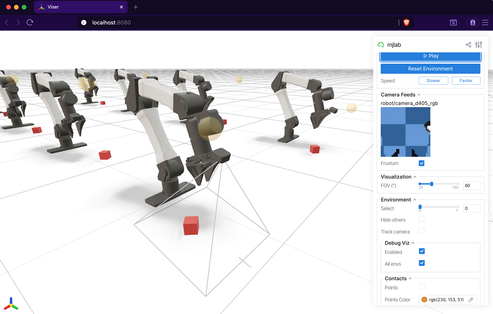

.. _viewers:

查看器
======

mjlab 自带两个交互式查看器，用于评估训练好的策略和调试环境行为：一个
基于 MuJoCo `passive viewer <https://mujoco.readthedocs.io/en/stable/python.html#passive-viewer>`_
的 **原生查看器**（打开桌面窗口），以及一个运行在浏览器中的
`Viser <https://viser.studio/main/>`_ **查看器**。两者共享同一个
``ViewerConfig``，执行相同的仿真循环；差别在于界面、功能集和各自的
适用场景。

启动查看器
----------

``play`` 脚本接受 ``--viewer`` 标志：

.. code-block:: bash

    # Desktop window (MuJoCo native viewer).
    uv run play Mjlab-Velocity-Flat-Unitree-G1 --viewer native \
        --wandb-run-path your-entity/your-project/run_id

    # Browser-based viewer (opens localhost:8080).
    uv run play Mjlab-Velocity-Flat-Unitree-G1 --viewer viser \
        --wandb-run-path your-entity/your-project/run_id

默认值为 ``auto``：有显示服务器（``DISPLAY`` 或 ``WAYLAND_DISPLAY``）
时选原生，无头机器上退回 Viser。

没有训练好的检查点也能快速探索：传 ``--agent zero`` 或
``--agent random`` 使用虚拟策略：

.. code-block:: bash

    uv run play Mjlab-Velocity-Flat-Unitree-G1 --agent zero --viewer viser

查看器配置
----------

相机位置、跟踪目标和渲染选项都在 ``ViewerConfig`` 中，通过
``ManagerBasedRlEnvCfg`` 的 ``viewer`` 字段设置：

.. code-block:: python

    from mjlab.viewer import ViewerConfig

    viewer = ViewerConfig(
        lookat=(0.0, 0.0, 0.5),
        distance=3.0,
        elevation=-20.0,
        azimuth=135.0,
    )

``origin_type`` 字段控制相机参考系：

.. list-table::
   :header-rows: 1
   :widths: 22 78

   * - 原点类型
     - 行为
   * - ``WORLD``
     - 锚定在世界原点的自由相机（默认）。
   * - ``ASSET_ROOT``
     - 相机跟踪 ``entity_name`` 所指实体的根 body。适合机器人在世界中
       移动的运动任务。
   * - ``ASSET_BODY``
     - 相机跟踪 ``entity_name`` 所指实体内的特定 body
       （``body_name``）。适合末端执行器或头部的特写。

带资产跟踪的示例：

.. code-block:: python

    viewer = ViewerConfig(
        origin_type=ViewerConfig.OriginType.ASSET_ROOT,
        entity_name="robot",
        distance=2.5,
        elevation=-15.0,
    )

其他字段：

- ``enable_shadows`` 与 ``enable_reflections`` 控制渲染质量。
- ``height`` 与 ``width`` 设置离屏渲染分辨率（供 ``OffscreenRenderer``
  与视频录制使用）。
- ``env_idx`` 选择启动时显示的环境。

原生 MuJoCo 查看器
-------------------

.. figure:: ../../source/_static/native_viewer.png
   :width: 100%
   :align: center
   :alt: Native MuJoCo viewer with reward plots

原生查看器在桌面窗口中打开 MuJoCo 的
`passive viewer <https://mujoco.readthedocs.io/en/stable/python.html#passive-viewer>`_。
它提供最快、最忠实的渲染，具备完整的 MuJoCo 视觉保真度。本地迭代和
交互式扰动测试请选它。MuJoCo 团队有一个
`视频教程 <https://www.youtube.com/watch?v=P83tKA1iz2Y>`_
介绍查看器的内置控制与导航。

**键盘控制。**

.. list-table::
   :header-rows: 1
   :widths: 18 82

   * - 按键
     - 动作
   * - ``Space``
     - 暂停或恢复仿真。
   * - ``Enter``
     - 重置环境。
   * - ``+`` / ``-``
     - 提高或降低回放速度。
   * - ``<`` / ``>``
     - 在环境之间循环切换（``num_envs > 1`` 时）。
   * - ``A``
     - 切换同时渲染所有环境。激活时调试可视化会为所有环境绘制。
   * - ``P``
     - 切换奖励曲线图。
   * - ``R``
     - 切换调试可视化。

**奖励曲线图。**
按 ``P`` 会在窗口右缘的条带中显示逐项奖励曲线。每项各占一张图，y 轴
自动缩放。图实时更新，环境重置时清空。这是诊断回合采样中哪些奖励项
占主导或行为异常的最快方式。

**交互式扰动。**
回放时点击并拖动场景中的任意 body 即可施加外力。力在下一步传入仿真，
无需写任何代码就能测试平衡恢复、抓取鲁棒性或抗扰性。

鼠标扰动力与程序化扰动力（如 ``apply_body_impulse`` ）通过不同的
MuJoCo 通道保持分离：程序化力使用 ``xfrc_applied`` （笛卡尔 body 力），
鼠标力则经 ``mj_applyFT`` 转换为 ``qfrc_applied`` （广义关节力）。两个
通道在正向动力学中求和，因此可以无冲突共存。

**域随机化可视化。**
原生查看器每帧把所有可视化类 DR 字段从 GPU 同步到 CPU。随机化的 geom
颜色、尺寸、位置、材质颜色、body 位姿、相机参数、光源位置和惯量椭球
都能忠实渲染。只要 DR 事件改了可视化属性，原生查看器就会显示出来。

Viser（基于浏览器）
--------------------

`Viser <https://viser.studio/main/>`_ 查看器在浏览器中的
``localhost:8080`` 打开交互式 3D 场景。它可以通过 SSH 隧道在远程机器上
工作，是无头 GPU 服务器和共享调试会话的天然选择。其 Web 架构让它的
可定制性远超原生查看器，还提供原生查看器没有的相机传感器输出专用
面板。

**标签页式界面。**
侧边栏把控件组织成几个标签：

- **Controls**：播放/暂停、重置、速度调节、环境选择和显示设置（FOV、
  接触、geom 组、相机跟踪）。
- **Rewards**：实时逐项奖励图表，复选框开关。
- **Metrics**：存在 ``MetricsManager`` 时的实时逐项指标图表。
- **Camera Feeds**：场景中每个 ``CameraSensor`` 的实时 RGB 与深度图像
  面板。深度比例滑杆调整可视化范围，视锥开关在 3D 场景中画出相机
  视场。
- **Groups**：显示或隐藏 MuJoCo geom 与 site 组。

**相机传感器集成。**
Viser 自动发现场景中的所有 ``CameraSensor`` 实例，并把输出显示为实时
图像面板。每个相机还会在 3D 视口中画出视锥可视化，让你确切看到传感器
覆盖的范围。这让 Viser 成为调试相机摆放、视场和深度感知的最佳工具。

**接触可视化。**
Controls 标签提供接触渲染选项。启用后接触点显示为彩色标记，接触力
显示为红色箭头，对碰撞行为提供即时视觉反馈。

.. note::

   Viser 查看器不支持交互式扰动（对 body 施加力旋量）。需要时请用
   原生查看器，或经 :ref:`events <events>` 配置扰动。

.. note::

   Viser 每帧直接从 GPU 读取世界系 body 位置，body 位姿更新正确。
   但 ``geom_rgba`` 和 ``geom_size`` 在场景构建时烘焙进 GLB 网格，
   不会反映按 world 的 DR 变化。未来版本会解决。现阶段需要验证可视化
   类 DR 时请用原生查看器。

调试可视化
----------

两个查看器都支持共享的 ``DebugVisualizer`` 接口，管理器项可以向其中
绘制。可用图元：

- **箭头**：速度指令、力向量、朝向指示。
- **球**：目标位置、接触点。
- **圆柱**：肢体目标、距离标记。
- **椭球**：惯量可视化。
- **坐标系**：body 系姿态、末端执行器目标。
- **幻影网格**：机器人在目标位姿处的透明渲染，适合运动跟踪或目标
  可视化。

原生查看器中按 ``R`` 切换调试可视化，按 ``A`` 同时显示所有环境的
调试绘制。Viser 中两者都在 Controls 标签里有开关。
``DebugVisualizer`` 抽象意味着奖励与指令项只需绘制一次，两个查看器
无需任何查看器特定代码即可显示结果。

离屏渲染器
----------

无显示环境下录制视频用 ``OffscreenRenderer``——它使用 MuJoCo 的离屏
渲染管线渲染帧。支持相同的 ``ViewerConfig`` 相机配置，可接受调试
可视化回调。渲染器硬性上限 32 个环境，以控制内存与渲染时间。

设置 ``--video`` 标志时 ``play`` 脚本使用 ``OffscreenRenderer``：

.. code-block:: bash

    uv run play Mjlab-Velocity-Flat-Unitree-G1 --video --video-length 300 \
        --wandb-run-path your-entity/your-project/run_id

快速对比
--------

.. list-table::
   :header-rows: 1
   :widths: 24 38 38

   * -
     - 原生
     - Viser
   * - 界面
     - 桌面窗口
     - 浏览器（``localhost:8080``）
   * - 最适合
     - 本地迭代、扰动测试
     - 定制、远程开发、相机
   * - 奖励曲线
     - ``P`` 键，右侧条带
     - Rewards 标签，uPlot 图表
   * - 指标曲线
     -
     - Metrics 标签
   * - 相机画面
     -
     - 自动发现，带视锥
   * - 扰动
     - 点击拖拽
     -
   * - DR 可视化
     - 完整（全部可视化字段同步）
     - 部分（仅 body 位姿）
   * - 接触渲染
     -
     - 接触点与接触力
   * - 多环境
     - ``<`` ``>`` 循环，``A`` 全部
     - 下拉选择器

引用
----

如果你在研究中使用了 Viser 查看器，请考虑引用：

.. code-block:: bibtex

    @article{yi2025viser,
        title={Viser: Imperative, web-based 3d visualization in python},
        author={Yi, Brent and Kim, Chung Min and Kerr, Justin and Wu, Gina and Feng, Rebecca and Zhang, Anthony and Kulhanek, Jonas and Choi, Hongsuk and Ma, Yi and Tancik, Matthew and Kanazawa, Angjoo},
        journal={arXiv preprint arXiv:2507.22885},
        year={2025}
    }
