# 中央决策树

本文件维护足球运球项目的全局决策结构。树中的「当前」表示已选择的实现路径，
「备选」表示只在触发条件满足并有实验证据后才切换的分支。

```mermaid
flowchart TD
  ROOT["MJLab 足球运球"]

  ROOT --> ENV["ENV 环境基线（里程碑 M0）"]
  ENV --> T0["地形"]
  T0 --> T1["当前：MuJoCo 无限平面"]
  T0 -.-> T2["备选：程序化粗糙地形"]
  ENV --> R0["机器人"]
  R0 --> R1["当前：Unitree G1"]
  ENV --> B0["足球"]
  B0 --> B1["当前：球体 0.1098 m / 0.43 kg / condim 6"]
  B0 -.-> B2["待决：弹跳与滚动阻力实验标定"]

  ROOT --> CMD["CMD 速度指令（里程碑 M0-M3）"]
  CMD --> C0["ADR-0001"]
  C0 --> C1["当前：100% heading 参考配置"]
  C0 -.-> C2["备选：30% heading 分阶段训练"]

  ROOT --> OBS["OBS 观测（里程碑 M0-M3）"]
  OBS -.-> O1["待决：球状态、延迟、历史和特权信息"]

  ROOT --> OBJ["OBJ 奖励与终止（里程碑 M2-M3）"]
  OBJ --> W0["ADR-0002"]
  W0 --> W1["当前：周期净位移 + 身前硬区间"]
  W0 -.-> W2["备选：区域外平滑衰减"]
  OBJ --> W3["ADR-0003"]
  W3 --> W4["当前：保留MJLab正则 + 补3项"]
  W3 -.-> W5["备选：参考姿态/接触奖励消融"]
  OBJ --> W6["ADR-0004"]
  W6 --> W7["当前：宽恢复区 + 0.8rad摔倒阈值"]
  W6 -.-> W8["备选：70度摔倒阈值"]
  OBJ -.-> W9["待决：完整奖励权重"]

  ROOT --> DR["DR 域随机化与鲁棒性（里程碑 M4-M5）"]
  DR --> D0["ADR-0005"]
  D0 --> D1["当前：协调重置 + 球速±1.5m/s"]
  D0 -.-> D2["备选：零球速或±0.05m/s"]
  DR --> D3["ADR-0006"]
  D3 --> D4["当前：5-6秒参考速度扰动"]
  D3 -.-> D5["备选：高频强扰动或真实冲量"]
  DR --> D6["ADR-0007"]
  D6 --> D7["当前：仅随机足球滑动摩擦"]
  D6 -.-> D8["待决：滚动摩擦与弹跳随机化"]

  ROOT --> TL["TL 行走到运球迁移（里程碑 M1-M2）"]
  TL --> L0["ADR-0008"]
  L0 --> L1["当前：490/505 行走兼容任务"]
  L1 --> L2["已验证：公共观测严格前缀 + 29维动作"]
  L0 -.-> L3["待实现：Actor-only checkpoint 迁移"]
```

## 分支索引

| 分支 | 当前选择 | 备选/待决 | 切换触发条件 | 证据与记录 |
|---|---|---|---|---|
| ENV/地形 | MuJoCo 无限平面 | 程序化粗糙地形 | 平地运球基线达标后进入鲁棒性训练 | 待建 ADR |
| ENV/机器人 | Unitree G1 | 其他平台 | 目标硬件或任务范围变更 | 待建 ADR |
| ENV/足球 | `r=0.1098 m`、`m=0.43 kg`、`condim=6` | 弹跳与滚动阻力标定 | 落球、滚动或碰撞曲线与目标不符 | [ADR-0007](0007-足球接触摩擦基线与随机化.md) |
| CMD/指令 | 100% heading | 30% heading | 转向与控球无法同时收敛 | [ADR-0001](0001-足球速度指令方案.md) |
| OBS/观测 | 待决 | 参考配置与精简方案 | 完成观测语义和坐标系核对 | 待建 ADR |
| OBJ/足球推进与控球 | 周期净位移、身前硬区间 | 区域外平滑衰减 | 核心区外恢复率过低 | [ADR-0002](0002-足球推进与可控区域奖励.md) |
| OBJ/机器人正则 | 保留 MJLab G1 正则并补 3 项 | 参考姿态、对称和接触奖励消融 | 新增项压制触球或现有正则不足 | [ADR-0003](0003-机器人正则奖励迁移策略.md) |
| OBJ/终止 | 宽恢复区、摔倒阈值 0.8 rad | 摔倒阈值 70 度 | 可恢复动作频繁误终止 | [ADR-0004](0004-足球失控与摔倒终止条件.md) |
| OBJ/奖励权重 | 待决 | 参考权重与分阶段奖励 | 终止配置固化后 | 待建 ADR |
| DR/重置 | 协调重置、球速 ±1.5 m/s、关节偏移 ±0.1 rad | 零球速或 ±0.05 m/s | 重置后早期失控率过高 | [ADR-0005](0005-机器人与足球协调重置.md) |
| DR/扰动 | 5-6 秒参考速度扰动 | 高频强扰动或真实冲量 | 基线稳定后进入鲁棒性对比 | [ADR-0006](0006-机器人周期速度扰动.md) |
| DR/接触物理 | 足球滑动摩擦 `[0.05, 0.15]` | 扭转、滚动与弹跳随机化 | 滚动和落球实验完成标定 | [ADR-0007](0007-足球接触摩擦基线与随机化.md) |
| TL/行走预训练 | 独立 `490/505` 兼容任务 | 直接使用原生 99 维任务 | 足球公共观测或动作接口变化 | [ADR-0008](0008-行走预训练与足球策略兼容布局.md) |
| TL/权重迁移 | 待实现 Actor-only 加载器 | 原项目按形状同时迁移 Actor/Critic | 行走 checkpoint 训练完成 | [ADR-0008](0008-行走预训练与足球策略兼容布局.md) |

## 状态约定

- 实线：当前已选择或正在实现的路径。
- 虚线：备选、待决或需要实验证据的分支。
- ADR 的状态与本树必须一致；冲突时以最新的 Accepted ADR 为准并立即修正本树。
